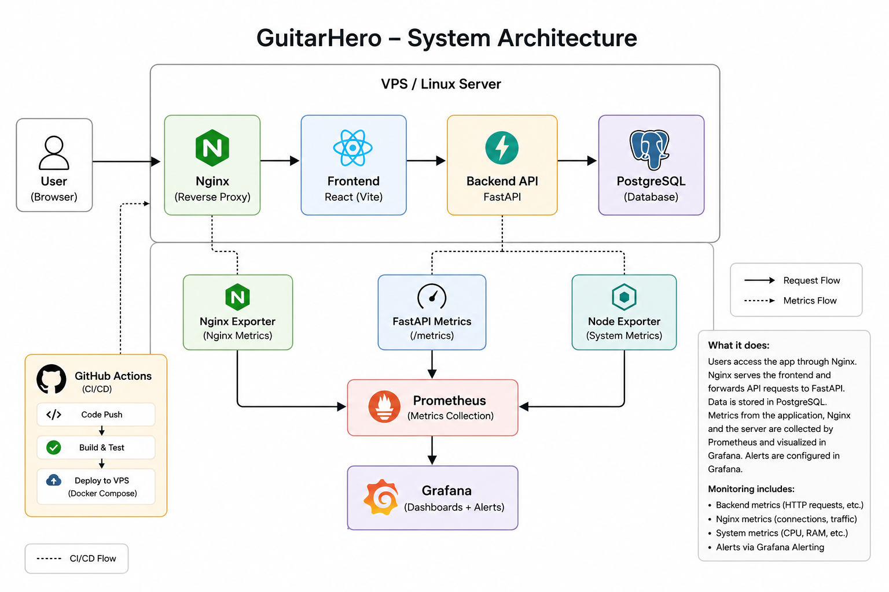
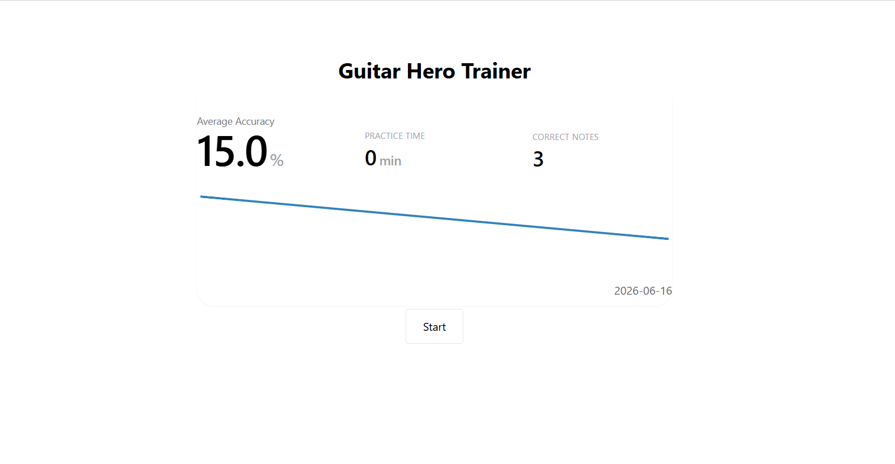
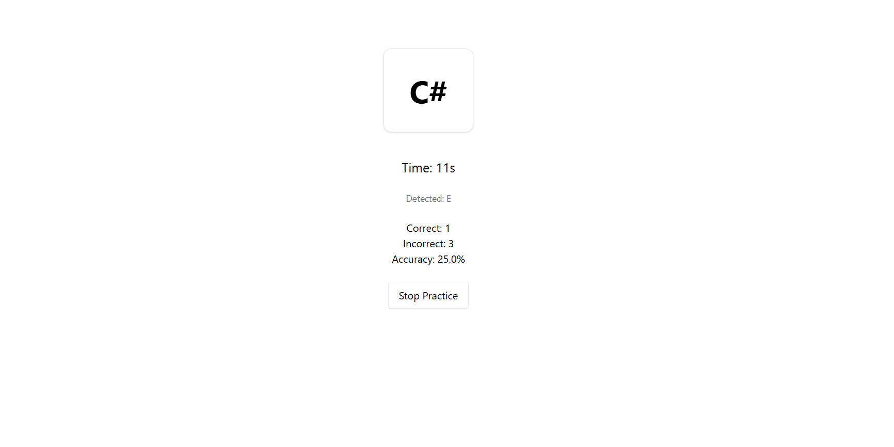
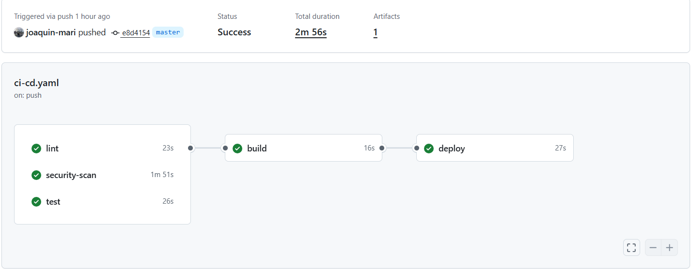
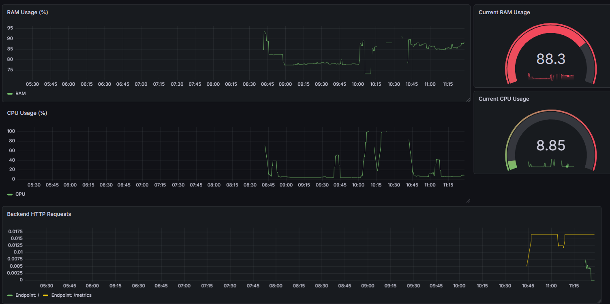
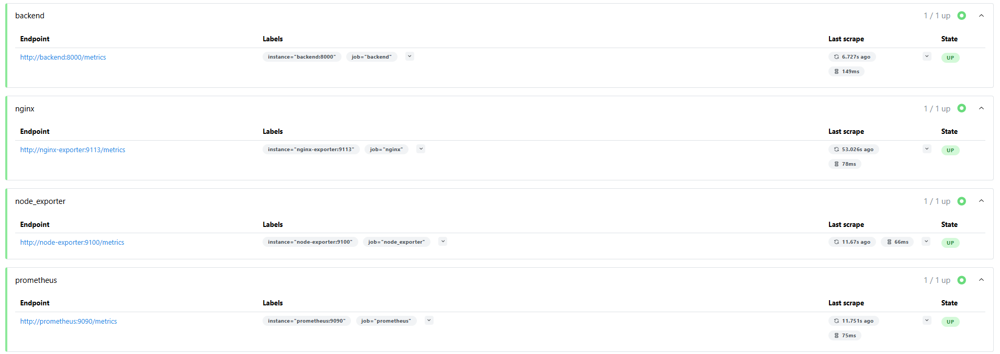

# GuitarHero 🎸

GuitarHero is a full-stack guitar practice tracker built mainly as a **DevOps learning project**. The goal was not to build a complex application, but to learn real-world DevOps workflows: deployment, CI/CD, monitoring, and observability.

The application itself is intentionally simple so the focus stays on the infrastructure around it.

---

## 🚀 What it does

- Track guitar practice sessions (duration, correct/incorrect notes)
- Generate random notes for practice
- View weekly practice statistics
  
---

## 🧱 Tech Stack

### Application

- React (Vite)
- FastAPI
- PostgreSQL

### DevOps / Infrastructure (main focus)

- Docker + Docker Compose
- Nginx reverse proxy
- Prometheus (metrics collection)
- Grafana (dashboards + alerting)
- Node Exporter (server metrics)
- Nginx Exporter (web server metrics)

### CI/CD

- GitHub Actions
- Automated linting, tests, and security scans
- Deployment to VPS via SSH
- Docker Compose-based deployment on server

---

## 📊 Monitoring & Alerting

This project includes full observability:

### Application metrics

- HTTP request counts per endpoint (FastAPI + Prometheus)
- Backend health (`up` metric)

### Infrastructure metrics

- CPU usage
- RAM usage
- System load (Node Exporter)

### Nginx metrics

- Active connections
- Reading / writing / waiting connections

### Alerts

Grafana alerting is configured for:

- High CPU usage
- High memory usage
- Backend service downtime

---

## ⚙️ CI/CD Pipeline

On every push to `master`:

- Frontend linting and tests
- Backend linting (ruff, sqlfluff) and tests
- Security scanning (CodeQL)
- Build frontend
- Deploy to VPS via SSH
- Run `docker compose up -d` on the server

---

## 🌐 Service Architecture

- User traffic is routed through Nginx reverse proxy  
- Frontend is served via containerized React build  
- Backend API is exposed under `/api`  
- Metrics are collected via Prometheus + exporters  
- Dashboards and alerting are handled by Grafana, accessed locally via SSH tunnel due to server limitations

## 📈 Architecture

---

## 🧠 What this project is about

This is not mainly a full-stack project.

It is a DevOps learning project disguised as a simple web app, used to practice:

- Containerization (Docker)
- Server deployment (VPS + Linux)
- CI/CD pipelines (GitHub Actions)
- Monitoring (Prometheus + Grafana)
- Alerting (Grafana alert rules)
- System observability (CPU, RAM, HTTP metrics)
- Debugging real infrastructure issues

---

## 📷 Screenshots

